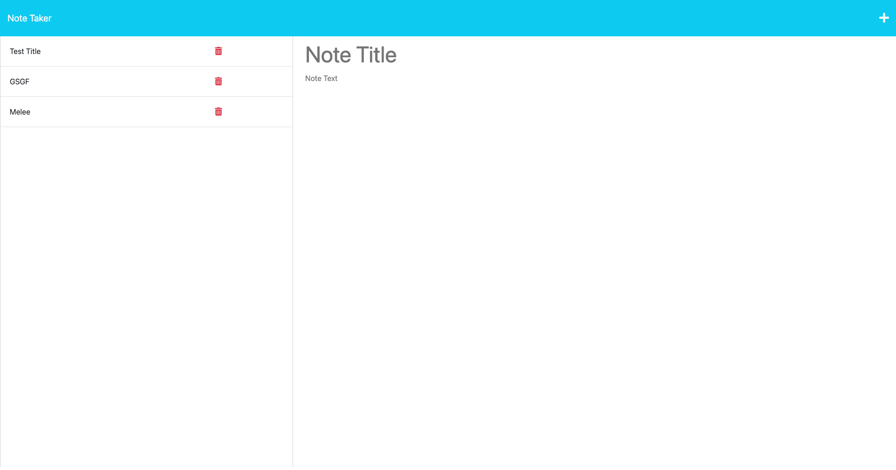
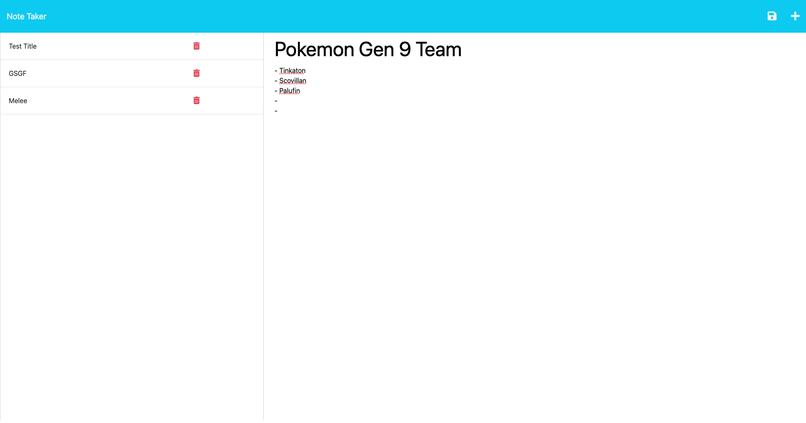

# NoteMaximumTaker

# 

## Table of Contents

- [Description](#description)
- [Usage](#usage)
- [License](#license)
- [Contributing](#contributing)
- [Tests](#tests)
- [Live Link](#live-url)
- [Questions](#questions)

## Description

This is a Note Taking application created to provide a way to document information quickly.

When I open the Note Taker I am presented with a landing page with a link to a notes page.

If I click on the link to the notes page I am presented with a page with existing notes listed in the left-hand column.
I am also presented with empty fields to enter a new note title and the note’s text in the right-hand column.

When I enter a new note title and the note’s text A Save icon appears in the navigation at the top of the page.
I have the option to click on the Save icon saving the new note in the left-hand column with the other existing notes.
If I click on an existing note in the list in the left-hand column that note appears in the right-hand column with its details.

If I click on the Write icon (plus sign) in the navigation at the top of the page I am presented with empty fields to enter a new note title and the note’s text in the right-hand column

## Usage

## License

This project is licensed under the MIT license. For more information about the license, go to [License](https://choosealicense.com/licenses/mit/).

## Creator

Bruno Rosarini

## Contributing

- Austin Grech

## Tests

N/A

## Live URL

URL: 

## Questions

For any questions, please reach out via GitHub or email:

- GitHub: [BrunoRosarini](https://github.com/BrunoRosarini)

- Email: (rosarinibruno@gmail.com)